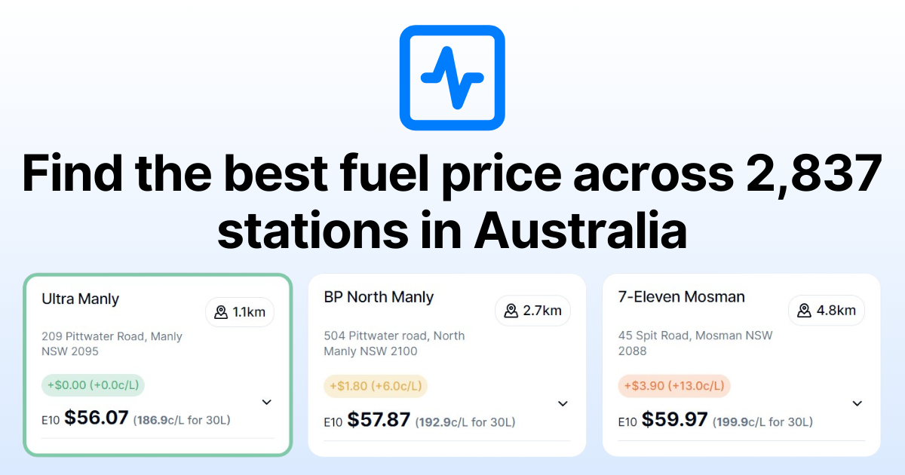

# Fuel Pulse

Effortlessly locate the most economical fuel prices near you. Streamlined. User-Friendly. Constantly Updated.

Checkout https://fuelpulse.troypoulter.com/!

## Features

- Filters your nearest fuel stations by location and fuel type
- Displays the cost of a full tank alongside the cost per litre
- Sort by price or by distance
- Responsive design, working well on all screen sizes
- NSW supported, more states and territories support coming in the future!

## Motivation

I've wanted to explore building a public app that collects and displays real data, considers SEO and to try out technologies like [Next.js](https://nextjs.org/) with Server-Side Rendering (SSR), to mix it up from my day-to-day work.

I set out to build a decently functional fuel price tracking app, that uses live data from [NSW Government's Fuel API](https://api.nsw.gov.au/Product/Index/22), the state I live in Australia, to help my partner see the price difference at a tank level, like 30L, instead of per litre - so I thankfully will always have one user.

I also wanted to put a time limit on it, most of the core functionality was built in just over a week during the holidays in 2023/2024 before I went back to work, and I am very happy I was able to finish* a side project!

*By finish, I of course mean, the first public version, as I have many more ideas I'd love to add to this over time, or for others to add! It surprised me just how much functionality a fuel price tracking app can have.

## Tech Stack

- [Next.js](https://nextjs.org/)
- [TailwindCSS](https://tailwindcss.com/) & [shadcn/ui](https://ui.shadcn.com/)
- [SQLite](https://www.sqlite.org/index.html) hosted via [Turso](https://turso.tech/)
- [DrizzleORM](https://orm.drizzle.team/)
- [Vercel](https://vercel.com/) for hosting and deployment
- [Plausible](https://plausible.io/) for analytics

## Contributing

Contributions are always welcome!

See [CONTRIBUTING.md](CONTRIBUTING.md) for ways to get started.

## Feedback

Feedback is appreciated! Reach out on [Twitter](https://twitter.com/troypoulterr) or submit a new issue!

## License

Licensed under the [MIT license](LICENSE.md).